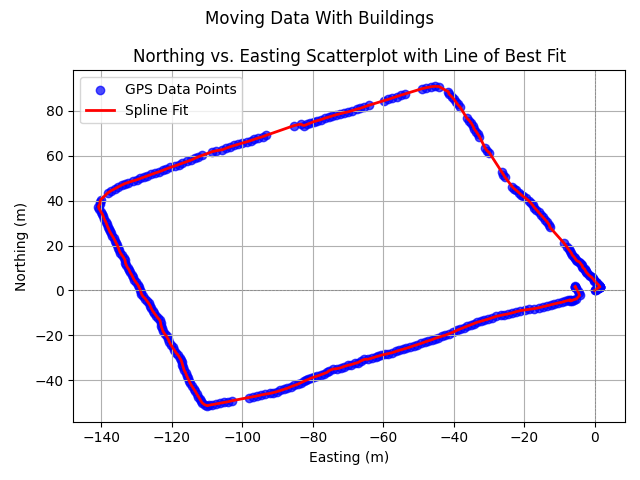
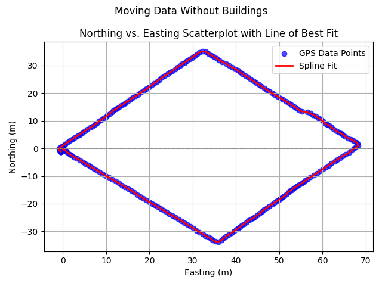

# RTK-GPS-Driver
This is a RTK GPS ROS Driver package for USB simpleRTK2B GPS


---
## The File Structure

### lab2/analysis
This folder contains the code for the analysis of the RTK GNSS data.
### lab2/analysis/output
This folder contains the output files of the analysis.
### lab2/Report and Analysis
This folder contains the report and analysis of the assignment.
### lab2/data/raw_rtk_data
This folder contains the raw RTK GNSS data file with .ubx expension that are collected from u-center app.
### lab2/data/ros_bags_rtk
This folder contains the ROS bag file of the RTK GNSS data published as ros topic gps.
### lab2/rtk_gps_driver/src
This folder contains the code for the ROS driver of the RTK GPS.
### lab2/rtk_gps_driver/launch
This folder contains the launch files for the ROS driver.
### lab2/rtk_gps_driver/msg
This folder contains the RTK Custom GPS message definition for the ROS driver.

---

## Results of Analysis

Results with Buildings:


Results without Buildings:


For more details analysis refer to [Analysis Report](analysis/Report%20and%20Analysis/Report.pdf)

## Running the Node

You can run the gps driver in two main ways:

### 1. Using the Launch File with the Default Port

To start the node with the default file, use the following command:

The default file is open_stationaty.ubx

### Make sure the file is running from rtk_gps_driver folder to access the local file correctly

open a termial  and navigate to the rtk_gps_driver folder or open a terminal directly in the rtk_gps_driver folder

```bash
roslaunch rtk_gps_driver standalone_driver.launch
```

### 2. Overriding the Port Argument in the Launch File

If you want to specify a different file, you can override the port argument like this:

```bash
roslaunch rtk_gps_driver standalone_driver.launch file_path:=open_walking.ubx
```

### 3. Running the Script Directly

### Make sure the file is running from rtk_gps_driver folder to access the local file correctly

You can also run the script directly and specify the port as a command-line argument:

terminal 1

```bash
roscore
```

terminal2 

```bash
rosrun rtk_gps_driver standalone_driver.py <file_name>
```

or 

```bash
python3 standalone_driver.py <file_name>
```

example 

```bash
rosrun rtk_gps_driver standalone_driver.py open_walking.ubx
```

or 

```bash
python3 standalone_driver.py open_walking.ubx
```

### The sample snippet to read data of RTK GPS and printing in terminal

set baudrate to 115200 with u-center app.

open terminal in lab2/rtk_gps_driver/src

connect with  the RTK GPS device from any of the USB port, and run the following command to get port number


```bash
ls  /dev/tty*
```

exmaple port will look like /dev/ttyACM*

then update the number in the lab2/rtk_gps_driver/src/rtk.py file and run the below command to print  the data in terminal

by default the script runs with /dev/ttyACM0


```bash
python3 rtk.py
```

---

### Running the analysis scripts

To run the analysis scripts, navigate to the `analysis` folder and run the following commands:

#### One the terminal from the analysis folder and run all the analysis scripts

To run the entire stationary analysis 

```bash
python3 stationary_analysis_with_and_without_building.py
```

To run the entire moving analysis

```bash
python3 moving_data_analysis_with_and_without_buildings.py
```

To view the plots serparately for stationary data collected with buildings

```bash
python3 stationary_analysis_with_building.py
```

To view the  plots serparately for stationary data collected without buildings

```bash
python3 stationary_analysis_without_building.py
```

To view the plots serparately for moving data collected with buildings

```bash
python3 moving_data_analysis_with_building.py
```

To view the  plots serparately for moving data collected without buildings

```bash
python3 moving_data_analysis_without_building.py
```

---
